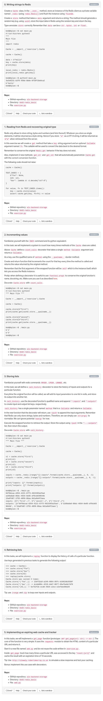

# Redis basics
## Resources
* [Redis commands](https://redis.io/commands/)
* [Redis python client](https://redis-py.readthedocs.io/en/stable/)
* [How to Use Redis With Python](https://realpython.com/python-redis/)
* [Redis Crash Course Tutorial](https://www.youtube.com/watch?v=Hbt56gFj998)

## Requirements
* Your code should use the `pycodestyle` style (version 2.5)
* All your functions and coroutines must be type-annotated.

## Install Redis on Ubuntu 18.04
```
$ sudo apt-get -y install redis-server
$ pip3 install redis
$ sed -i "s/bind .*/bind 127.0.0.1/g" /etc/redis/redis.conf
```

## Use Redis in a container

Redis server is stopped by default - when you are starting a container, you should start it with: `service redis-server start`

## Tasks
<details>
    <summary></summary>
    
</details>
